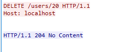

# TCP 소켓 기반 HTTP Client/Server 구현 프로젝트

**과목명**: 컴퓨터 네트워크
**프로젝트명**: TCP 소켓 프로그래밍을 이용한 HTTP GET/HEAD/POST/PUT/DELETE 통신 구현
**구현 언어**: Python 3.13
**작성자**: 20243149 인공지능학부 박재원
---

## 목차

1. 과제 목적
2. 개발 및 실행 환경
3. TCP 소켓 통신 개념
4. HTTP 프로토콜 개념
5. 프로그램 구조 및 파일 설명
6. 서버(server.py) 동작 과정
7. 클라이언트(client.py) 동작 과정
8. 실행 방법
9. HTTP 요청/응답 실행 결과 (Method-상태코드 케이스)
10. Wireshark 패킷 캡처 및 분석
11. 결론
부록 A. 전체 소스코드

---

## 1. 과제 목적

본 프로젝트는 TCP 기반 소켓 프로그래밍을 통해 Client-Server 구조의 통신 프로그램을 직접 구현하고, 그 위에서 HTTP 프로토콜의 요청(Request)과 응답(Response) 메시지를 애플리케이션 레벨에서 수동으로 파싱·생성함으로써 HTTP가 실제로 어떤 텍스트 포맷으로 주고받아지는지를 이해하는 것을 목표로 한다.

일반적으로 웹 프로그래밍에서는 Flask, Express, requests 라이브러리 등 이미 HTTP를 처리해주는 프레임워크를 사용하지만, 본 과제에서는 그러한 프레임워크 없이 순수 TCP 소켓(`socket` 모듈)만을 사용하여

- 클라이언트가 HTTP Request Line, Header, Body를 직접 문자열로 구성하여 전송하고
- 서버가 수신한 바이트 스트림을 파싱하여 Method/Path/Header/Body를 분리하고
- 요청에 맞는 처리를 수행한 뒤 상태 코드(Status Code)와 함께 HTTP Response를 직접 조립하여 반환한다.

이를 통해 다음을 학습한다.

- TCP 소켓의 3-way handshake, `bind`/`listen`/`accept`/`connect`/`send`/`recv`/`close`의 흐름
- HTTP 요청 메시지와 응답 메시지의 정확한 포맷 (`\r\n` 구분자, 빈 줄로 헤더/바디 구분)
- GET, HEAD, POST, PUT, DELETE 메서드의 의미 차이와 그에 따른 서버 처리 로직 차이
- 상태 코드(1xx, 2xx, 4xx 등)가 어떤 상황에서 사용되는지
- 실제 데이터베이스(SQLite)와 연동하여 요청에 따라 데이터를 조회/생성/수정/삭제하는 REST 스타일 API 서버 구현

---

## 2. 개발 및 실행 환경

| 항목 | 내용 |
|---|---|
| 운영체제 | Windows 10 |
| 언어 | Python 3.13.1 |
| 사용 모듈 | `socket` (표준 라이브러리), `json` (표준 라이브러리), `sqlite3` (표준 라이브러리) |
| 데이터베이스 | SQLite3 (`database/users.db`, 파일 기반 DB, 별도 서버 설치 불필요) |
| 통신 방식 | TCP (`SOCK_STREAM`), IPv4 (`AF_INET`) |
| 서버 주소 | `localhost` (127.0.0.1) — 1대의 PC로 실습 시 |
| 포트 번호 | 8080 |
| 실행 방식 | 서버와 클라이언트를 별도의 터미널(콘솔) 프로세스로 각각 실행 |
| 패킷 분석 도구 | Wireshark |

> 2대 이상의 PC 환경을 사용할 경우, `client.py`의 `serverName` 변수를 서버 PC의 실제 IP 주소로 변경하고, 서버 PC의 방화벽에서 8080 포트를 인바운드 허용하면 동일하게 동작한다. 본 보고서는 1대의 PC에서 `localhost`로 실습한 결과를 기준으로 작성하였다.

---

## 3. TCP 소켓 통신 개념

### 3.1 TCP의 특징

TCP(Transmission Control Protocol)는 연결 지향형(Connection-oriented), 신뢰성 있는(Reliable) 전달을 보장하는 전송 계층 프로토콜이다. UDP와 달리 데이터를 보내기 전에 반드시 **3-way handshake**를 통해 연결을 먼저 수립해야 하며, 전송 순서 보장과 오류 검출/재전송을 지원한다. HTTP는 신뢰성 있는 전달이 필요하므로 TCP 위에서 동작한다.

### 3.2 3-way Handshake

```
Client                          Server
  | ---- SYN ----------------->  |
  | <---- SYN + ACK ------------ |
  | ---- ACK ----------------->  |
  |        (연결 수립 완료)        |
```

본 프로젝트에서 `clientSocket.connect((serverName, serverPort))` 호출 시 위 3-way handshake가 OS 커널 레벨에서 자동으로 수행되며, Wireshark 캡처에서 이 과정을 실제로 확인할 수 있다 (10장 참고).

### 3.3 소켓 API 흐름

서버와 클라이언트가 사용하는 소켓 API 호출 순서는 다음과 같다.

**서버 측**

```
socket()  →  bind()  →  listen()  →  accept()  →  recv()/send()  →  close()
```

**클라이언트 측**

```
socket()  →  connect()  →  send()  →  recv()  →  close()
```

| 함수 | 역할 |
|---|---|
| `socket(AF_INET, SOCK_STREAM)` | IPv4 기반 TCP 소켓 생성 |
| `bind(('', port))` | 소켓에 로컬 IP/포트 할당 (서버 전용, `''`은 모든 인터페이스) |
| `listen()` | 클라이언트의 연결 요청을 대기하는 상태로 전환 |
| `accept()` | 대기 큐에서 연결 요청을 하나 꺼내 새로운 소켓(연결 전용 소켓)을 반환 |
| `connect((ip, port))` | 지정된 서버로 연결 요청(클라이언트 전용) |
| `send(data)` / `recv(bufsize)` | 데이터 송수신 (바이트 단위) |
| `close()` | 소켓 종료, 4-way handshake로 연결 해제 |

본 프로젝트의 서버는 `while True:` 반복문 안에서 `accept()`를 반복 호출하여, 하나의 요청을 처리하고 소켓을 닫은 뒤 곧바로 다음 클라이언트의 연결을 기다리는 **반복 서버(iterative server)** 구조로 구현하였다. 클라이언트는 요청 1건마다 새로운 소켓을 생성하여 연결 → 요청 → 응답 → 종료를 수행하는 **short-lived connection(비영속 연결)** 방식을 사용한다 (HTTP/1.0 스타일의 연결 방식과 유사).

---

## 4. HTTP 프로토콜 개념

### 4.1 요청(Request) 메시지 구조

```
<Method> <Path> <HTTP-Version>\r\n     ← Request Line
<Header-Name>: <Header-Value>\r\n      ← Header (0개 이상)
...
\r\n                                    ← 빈 줄 (헤더 종료)
<Body>                                  ← 바디 (선택적)
```

예시 (POST 요청):

```
POST /users HTTP/1.1
Host: localhost
Content-Type: application/json
Content-Length: 39
Expect: 100-continue

{"name": "Kim", "email": "kim@test.com"}
```

### 4.2 응답(Response) 메시지 구조

```
<HTTP-Version> <Status-Code> <Reason-Phrase>\r\n   ← Status Line
<Header-Name>: <Header-Value>\r\n                  ← Header
...
\r\n
<Body>
```

예시:

```
HTTP/1.1 200 OK
Content-Type: application/json

{"id": 1, "name": "Jaewon", "email": "jaewon@example.com"}
```

### 4.3 본 프로젝트에서 구현한 메서드

| Method | 의미 | 본 프로젝트에서의 처리 |
|---|---|---|
| GET | 리소스 조회 | `/users` 전체 조회 또는 `/users/{id}` 단건 조회 |
| HEAD | GET과 동일하되 응답 바디 없이 헤더만 반환 | GET과 같은 로직으로 존재 여부만 판단, 바디 미전송 |
| POST | 새 리소스 생성 | `/users`에 JSON 바디(`name`, `email`)로 새 사용자 추가 |
| PUT | 기존 리소스 수정(대체/갱신) | `/users/{id}`의 name/email을 갱신 |
| DELETE | 리소스 삭제 | `/users/{id}` 삭제 (과제 요구 4종 메서드 외 추가 구현) |

### 4.4 상태 코드 분류

| 분류 | 의미 | 본 프로젝트 사용 예 |
|---|---|---|
| 1xx (Informational) | 요청을 받았고 처리를 계속함 | `100 Continue` — POST/PUT에서 `Expect: 100-continue` 처리 시 |
| 2xx (Success) | 요청 성공 | `200 OK`, `201 Created`, `204 No Content` |
| 4xx (Client Error) | 클라이언트 요청 오류 | `400 Bad Request`, `404 Not Found` |
| 5xx (Server Error) | 서버 처리 오류 | 본 프로젝트에서는 미사용 (미구현 케이스) |

### 4.5 `Expect: 100-continue` 흐름 (1xx 상태 코드 구현)

바디가 있는 요청(POST, PUT)에서 클라이언트는 바디를 곧바로 보내지 않고, 먼저 `Expect: 100-continue` 헤더를 포함한 헤더만 전송한다. 서버는 이를 확인하고 `HTTP/1.1 100 Continue`를 먼저 응답하며, 클라이언트는 이 100 응답을 수신한 이후에 실제 바디를 전송한다.

```
Client                                Server
  |--- Header (Expect:100-continue) -->|
  |<--------- 100 Continue ------------|
  |--- Body -------------------------->|
  |<--------- 최종 응답(200/201/400 등) -|
```

이 구조 덕분에 POST/PUT 요청 시마다 실제로 1xx 상태 코드가 한 번씩 발생하며, 9장의 실행 결과에서 `interim -> HTTP/1.1 100 Continue` 로그로 확인할 수 있다.

---

## 5. 프로그램 구조 및 파일 설명

```
Socket_HTTP_Project/
├── server.py         # TCP 서버 + HTTP 요청 파싱/응답 (핵심 로직)
├── client.py         # TCP 클라이언트 + HTTP 요청 생성 + 테스트 케이스 실행기
├── seed_users.py      # SQLite DB 초기화 및 샘플 데이터 20건 삽입
└── database/
    └── users.db        # SQLite DB 파일 (users 테이블)
```

### 5.1 `seed_users.py`

`users` 테이블(`id`, `name`, `email`)을 생성하고, `Jaewon` ~ `Rina`까지 20명의 샘플 사용자를 삽입한다. `id`는 `INTEGER PRIMARY KEY AUTOINCREMENT`로 선언되어 있어 자동 증가한다. 서버를 처음 실행하기 전, 혹은 DB를 초기 상태로 되돌리고 싶을 때(특히 시연 영상 촬영 직전) `database/users.db` 파일을 삭제한 뒤 본 스크립트를 재실행하면 `id`가 1부터 다시 시작하는 깨끗한 상태로 초기화된다.

### 5.2 `server.py`

포트 8080에서 TCP 연결을 대기하다가, 연결이 들어오면 요청 데이터를 수신 → 파싱 → 메서드별 분기 처리 → SQLite 조회/변경 → HTTP 응답 문자열 조립 → 전송 → 소켓 종료를 반복하는 반복 서버.

### 5.3 `client.py`

`send_request(method, path, body)` 함수 하나로 모든 HTTP 요청을 생성/전송하고 응답을 콘솔에 출력한다. 하단에는 과제에서 요구하는 "Method-상태코드" 조합을 미리 정의한 `test_cases` 딕셔너리가 있어, 실행 시 번호를 입력하면 해당 케이스만, `0`을 입력하면 9개 케이스 전체를 순차 실행한다.

---

## 6. 서버(server.py) 동작 과정

### 6.1 초기화

```python
serverSocket = socket(AF_INET, SOCK_STREAM)
serverSocket.bind(('', serverPort))
serverSocket.listen()
print('The server is ready to receive')
```

TCP 소켓을 생성하고 8080 포트에 바인딩한 뒤, `listen()`으로 연결 대기 상태에 진입한다. `bind(('', serverPort))`에서 IP를 공백으로 지정하면 서버 PC의 모든 네트워크 인터페이스에서 오는 연결을 받아들이므로, `localhost` 실습뿐 아니라 2대 PC 환경에서도 별도 수정 없이 동작한다.

### 6.2 요청 수신 및 파싱

```python
connectionSocket, addr = serverSocket.accept()
request = connectionSocket.recv(1024).decode()
request_line = request.split("\r\n")[0]
method, path, version = request_line.split()
```

`accept()`로 클라이언트별 전용 소켓을 얻고, 첫 줄(Request Line)을 공백 기준으로 분리하여 Method/Path/HTTP-Version을 추출한다.

이어서 헤더 영역(`\r\n\r\n` 이전)만 잘라내어 한 줄씩 검사하며 `Content-Length`와 `Expect: 100-continue` 유무를 확인한다.

```python
header_part = request.split("\r\n\r\n")[0]
for line in header_part.split("\r\n")[1:]:
    if line.lower().startswith("content-length:"):
        content_length = int(line.split(":")[1].strip())
    if line.lower().startswith("expect:") and "100-continue" in line.lower():
        expect_continue = True
```

`Expect: 100-continue`가 확인되면 바디를 받기 전에 먼저 `100 Continue`를 응답하고, 이후 `Content-Length`만큼 바디를 마저 수신한다(첫 `recv`에 바디 일부가 이미 포함된 경우까지 고려하여 누락 없이 수신).

### 6.3 메서드별 분기 처리

| 분기 | 처리 내용 | 반환 상태 코드 |
|---|---|---|
| `GET /users` | 전체 사용자 목록을 JSON 배열로 반환 | 200 |
| `GET /users/{id}` | 단건 조회, 없으면 오류 | 200 / 404 |
| `GET` (그 외 경로) | 정의되지 않은 경로 | 404 |
| `HEAD /users`, `HEAD /users/{id}` | GET과 동일 로직으로 존재 여부만 판단, 바디는 응답하지 않음 | 200 / 404 |
| `POST /users` | 바디의 `name`, `email` 검증 후 DB에 삽입 | 201 / 400(필드 누락) |
| `PUT /users/{id}` | 대상 존재 확인 후 `name`/`email` 갱신 | 200 / 404 |
| `DELETE /users/{id}` | 대상 존재 확인 후 삭제 | 204 / 404 |
| 그 외 메서드 | 정의되지 않은 메서드 | 405 |

각 분기는 `sqlite3.connect("database/users.db")`로 DB에 접속하여 조회(`SELECT`)/삽입(`INSERT`)/수정(`UPDATE`)/삭제(`DELETE`) SQL을 실행하고, 결과에 따라 `json.dumps()`로 JSON 바디를 만들어 HTTP 응답 문자열에 붙인다.

### 6.4 응답 전송 및 종료

```python
connectionSocket.send(response.encode())
connectionSocket.close()
```

응답을 전송한 뒤 연결 소켓을 닫고, 서버는 `while True` 최상단으로 돌아가 다음 `accept()`를 대기한다.

---

## 7. 클라이언트(client.py) 동작 과정

### 7.1 요청 생성 — `send_request()`

```python
def send_request(method, path, body=""):
    clientSocket = socket(AF_INET, SOCK_STREAM)
    clientSocket.connect((serverName, serverPort))

    header_lines = f"Host: {serverName}"
    if body:
        header_lines += f"\r\nContent-Type: application/json\r\nContent-Length: {len(body.encode())}"
        header_lines += "\r\nExpect: 100-continue"

    request = f"{method} {path} HTTP/1.1\r\n{header_lines}\r\n\r\n"
    clientSocket.send(request.encode())
```

호출될 때마다 새 TCP 연결을 맺고, `Method`, `Path`, `Host` 헤더를 조합해 Request Line + Header를 만든다. 바디가 있는 경우(POST/PUT)에는 `Content-Type`, `Content-Length`, `Expect: 100-continue` 헤더를 추가한다.

### 7.2 100 Continue 처리 후 바디 전송

```python
if body:
    interim = clientSocket.recv(1024).decode()
    print(f"[{method} {path}] interim ->", interim.split("\r\n")[0])
    if interim.startswith("HTTP/1.1 100"):
        clientSocket.send(body.encode())
```

서버로부터 `100 Continue`를 받은 뒤에야 실제 JSON 바디를 전송한다.

### 7.3 최종 응답 수신 및 출력

```python
response = clientSocket.recv(4096).decode()
status_line = response.split("\r\n")[0]
print(f"[{method} {path}] -> {status_line}")
print(response)
```

서버의 최종 응답(Status Line + Header + Body)을 수신하여 콘솔에 그대로 출력한다.

### 7.4 테스트 케이스 실행기

```python
test_cases = {
    "1": ("GET-200", ...),
    "2": ("GET-404", ...),
    "3": ("HEAD-200", ...),
    "4": ("POST-201", ...),
    "5": ("POST-400", ...),
    "6": ("PUT-200", ...),
    "7": ("PUT-404", ...),
    "8": ("DELETE-204", ...),
    "9": ("DELETE-404", ...),
}
```

번호를 입력받아 해당 케이스만 실행하거나, `0`을 입력하면 9개 케이스를 순서대로 모두 실행한다. 과제에서 요구한 "Method-상태코드 5개 이상" 조건을 충족하기 위해 GET/HEAD/POST/PUT/DELETE 5개 메서드 각각에 대해 성공/실패 케이스를 나누어 총 9개 조합을 준비하였다.

> **주의**: `DELETE-204` 케이스는 `/users/1`을 고정적으로 삭제하도록 구현되어 있으므로, 이미 한 번 삭제된 이후 재실행하면 `404 Not Found`가 반환된다. 204 응답을 재현하려면 시연 전에 `database/users.db`를 삭제하고 `seed_users.py`를 다시 실행하여 DB를 초기 상태로 되돌려야 한다.

---

## 8. 실행 방법

### 8.1 사전 준비 (DB 초기화)

```bash
cd Socket_HTTP_Project
python seed_users.py
```

실행 결과 예시:
```
20명의 유저 추가 완료
```

### 8.2 서버 실행 (터미널 1)

```bash
python server.py
```

실행 결과:
```
The server is ready to receive
```

서버는 이 상태로 계속 대기하며, 클라이언트 요청이 올 때까지 종료되지 않는다.

### 8.3 클라이언트 실행 (터미널 2, 별도 콘솔)

```bash
python client.py
```

실행하면 아래와 같은 메뉴가 출력된다.

```
테스트할 케이스를 선택하세요:
  1. GET-200
  2. GET-404
  3. HEAD-200
  4. POST-201
  5. POST-400
  6. PUT-200
  7. PUT-404
  8. DELETE-204
  9. DELETE-404
  0. 전체 실행
번호 입력:
```

번호(1~9) 또는 `0`(전체 실행)을 입력하면 해당 HTTP 요청이 서버로 전송되고, 응답이 클라이언트 콘솔에 출력된다.

### 8.4 2대 PC 환경으로 실행할 경우

1. 서버 PC에서 `python server.py` 실행, 방화벽에서 TCP 8080 인바운드 허용
2. 클라이언트 PC의 `client.py`에서 `serverName = 'localhost'`를 서버 PC의 실제 IP(예: `192.168.0.10`)로 변경
3. 두 PC가 같은 네트워크(같은 공유기/스위치)에 연결되어 있어야 함

---

## 9. HTTP 요청/응답 실행 결과 (Method-상태코드 케이스)

아래는 `seed_users.py`로 DB를 초기화한 직후, `python server.py` → `python client.py`(전체 실행, `0` 입력)로 얻은 **실제 실행 로그**이다. 총 9개의 Method-상태코드 조합을 확인할 수 있으며, 과제에서 요구한 "5개 이상" 조건을 초과 달성하였다.

### 9.1 GET-200 (전체 사용자 조회)

```
[GET /users] -> HTTP/1.1 200 OK
HTTP/1.1 200 OK
Content-Type: application/json

[{"id": 1, "name": "Jaewon", "email": "jaewon@example.com"}, {"id": 2, "name": "Minji", ...}, ..., {"id": 20, "name": "Rina", "email": "rina@example.com"}]
```
**설명**: `GET /users` 요청 시 DB에 저장된 20명의 사용자 정보를 JSON 배열로 반환한다. 리소스가 정상적으로 존재하므로 `200 OK`.

### 9.2 GET-404 (존재하지 않는 경로)

```
[GET /notfound] -> HTTP/1.1 404 Not Found
HTTP/1.1 404 Not Found
Content-Type: application/json

{"error": "not found"}
```
**설명**: 서버에 정의되지 않은 경로(`/notfound`)로 요청하면 `404 Not Found`와 함께 에러 메시지를 JSON으로 반환한다.

### 9.3 HEAD-200 (헤더만 응답)

```
[HEAD /users] -> HTTP/1.1 200 OK
HTTP/1.1 200 OK
Content-Type: application/json

```
**설명**: HEAD는 GET과 동일한 로직으로 리소스 존재 여부를 확인하지만, 응답 바디 없이 상태 라인과 헤더만 반환한다. 실제 로그에서도 `Content-Type` 헤더 이후 바디 없이 응답이 종료됨을 확인할 수 있다.

### 9.4 POST-201 (사용자 생성 성공) — 1xx + 2xx 동시 확인

```
[POST /users] interim -> HTTP/1.1 100 Continue
[POST /users] -> HTTP/1.1 201 Created
HTTP/1.1 201 Created
Content-Type: application/json

{"id": 21, "name": "Kim", "email": "kim@test.com"}
```
**설명**: `Content-Length`, `Expect: 100-continue` 헤더가 포함된 요청을 보내면 서버가 먼저 `100 Continue`를 응답(1xx)하고, 클라이언트가 실제 바디(JSON)를 전송하면 서버가 새 사용자를 DB에 삽입한 뒤 `201 Created`와 함께 생성된 사용자 정보(자동 증가된 `id: 21`)를 반환한다. 하나의 케이스에서 1xx와 2xx 응답을 모두 관찰할 수 있다.

### 9.5 POST-400 (필수 필드 누락)

```
[POST /users] interim -> HTTP/1.1 100 Continue
[POST /users] -> HTTP/1.1 400 Bad Request
HTTP/1.1 400 Bad Request
Content-Type: application/json

{"error": "name and email are required"}
```
**설명**: 바디로 빈 JSON(`{}`)을 전송하면 서버가 `name`, `email` 필드 누락을 감지하고 `400 Bad Request`를 반환한다. 클라이언트 요청 자체의 오류이므로 4xx 계열이다.

### 9.6 PUT-200 (사용자 정보 수정 성공)

```
[PUT /users/1] interim -> HTTP/1.1 100 Continue
[PUT /users/1] -> HTTP/1.1 200 OK
HTTP/1.1 200 OK
Content-Type: application/json

{"id": 1, "name": "Kim Updated", "email": "jaewon@example.com"}
```
**설명**: `id=1`(Jaewon)의 `name`만 `"Kim Updated"`로 갱신하는 요청. 대상이 존재하므로 DB `UPDATE` 후 갱신된 전체 사용자 정보를 `200 OK`로 반환한다. 요청 바디에 없는 `email` 필드는 기존 값을 그대로 유지한다.

### 9.7 PUT-404 (존재하지 않는 사용자 수정 시도)

```
[PUT /users/9999] interim -> HTTP/1.1 100 Continue
[PUT /users/9999] -> HTTP/1.1 404 Not Found
HTTP/1.1 404 Not Found
Content-Type: application/json

{"error": "user not found"}
```
**설명**: 존재하지 않는 `id=9999`를 수정하려 하면 DB 조회 결과가 없으므로 `404 Not Found`.

### 9.8 DELETE-204 (사용자 삭제 성공)

```
[DELETE /users/1] -> HTTP/1.1 204 No Content
HTTP/1.1 204 No Content

```
**설명**: `id=1` 사용자를 삭제한다. 삭제가 성공하면 반환할 바디가 없으므로 `204 No Content`를 사용하며, 실제로 바디 없이 상태 라인만 응답됨을 확인할 수 있다.

### 9.9 DELETE-404 (존재하지 않는 사용자 삭제 시도)

```
[DELETE /users/9999] -> HTTP/1.1 404 Not Found
HTTP/1.1 404 Not Found
Content-Type: application/json

{"error": "user not found"}
```
**설명**: 이미 없는(혹은 애초에 없던) `id=9999`를 삭제하려 하면 `404 Not Found`.

### 9.10 결과 요약표

| # | 요청 | 응답 상태 코드 | 분류 |
|---|---|---|---|
| 1 | GET /users | 200 OK | 2xx |
| 2 | GET /notfound | 404 Not Found | 4xx |
| 3 | HEAD /users | 200 OK | 2xx |
| 4 | POST /users (정상 바디) | 100 Continue → 201 Created | 1xx, 2xx |
| 5 | POST /users (필드 누락) | 100 Continue → 400 Bad Request | 1xx, 4xx |
| 6 | PUT /users/1 (정상 바디) | 100 Continue → 200 OK | 1xx, 2xx |
| 7 | PUT /users/9999 | 100 Continue → 404 Not Found | 1xx, 4xx |
| 8 | DELETE /users/1 | 204 No Content | 2xx |
| 9 | DELETE /users/9999 | 404 Not Found | 4xx |

과제 예시에서 제시한 "GET-4xx, GET-2xx, HEAD-1xx, POST-2xx, POST-1xx" 5가지 조합을 모두 포함하며(HEAD 자체는 1xx를 발생시키지 않으므로, 1xx는 바디를 포함하는 POST/PUT 요청에서 재현), 총 9개의 서로 다른 Method-상태코드 조합으로 요구 조건(5개 이상)을 초과 달성하였다.

---

## 10. Wireshark 패킷 캡처 및 분석

본 장에서는 9장에서 다룬 9개 케이스 중, 영상 시연용으로 선정한 아래 **5개 핵심 케이스**를 중심으로 Wireshark 캡처 결과를 정리한다. 이 5개는 과제가 필수로 요구하는 4개 메서드(GET/HEAD/POST/PUT)를 모두 포함하고, 1xx/2xx/4xx 상태 코드 분류도 겹치지 않게 구성한 조합이다.

| # | 케이스 | 메서드 | 상태 코드 |
|---|---|---|---|
| 1 | GET /users | GET | 200 OK |
| 2 | GET /notfound | GET | 404 Not Found |
| 3 | HEAD /users | HEAD | 200 OK |
| 4 | POST /users (정상 바디) | POST | 100 Continue → 201 Created |
| 5 | PUT /users/9999 | PUT | 100 Continue → 404 Not Found |
| 6 | DELETE /users/20 | DELETE | 204 No Content |

### 10.1 캡처 방법

1. Wireshark 실행 → 캡처 인터페이스로 **Loopback(localhost 통신용, `Npcap Loopback Adapter` 또는 `Adapter for loopback traffic capture`)** 선택 (localhost로 실습하는 경우)
2. 캡처 필터 또는 디스플레이 필터에 `tcp.port == 8080` 입력하여 8080 포트 트래픽만 확인
3. `python server.py` 실행 → `python client.py` 실행 순서로 캡처 시작 후, 위 5개 케이스를 번호(1, 2, 3, 4, 7)로 하나씩 실행 (client.py 메뉴의 4번=POST-201, 7번=PUT-404)
4. 요청마다 새 TCP 연결이 열리므로, 캡처 화면에서 `tcp.stream eq 0`, `eq 1`, `eq 2` … 순서로 필터를 바꿔가며 실행 순서와 매칭해서 확인하면 편리함
5. HTTP로 필터링하려면 `http` 디스플레이 필터도 함께 사용 가능 (단, Wireshark가 8080 포트를 HTTP로 자동 인식하지 못하면 패킷에서 우클릭 → `Decode As` → HTTP로 지정)

### 10.2 확인해야 할 항목

- **3-way Handshake**: `SYN` → `SYN, ACK` → `ACK` 3개 패킷이 각 요청 연결마다 반복되는지 확인 (본 프로젝트는 요청마다 새 연결을 맺으므로 요청 횟수만큼 handshake가 반복됨)
- **HTTP Request 패킷**: `GET /users HTTP/1.1`, `POST /users HTTP/1.1` 등 Request Line과 `Content-Length`, `Expect: 100-continue` 헤더가 페이로드에 그대로 담겨 있는지 확인
- **100 Continue 패킷**: POST/PUT 요청 시 서버가 바디를 받기 전에 별도의 작은 응답 패킷(`HTTP/1.1 100 Continue`)을 먼저 보내는 것을 확인 — 요청 헤더 패킷과 바디 패킷 사이에 별도로 존재
- **HTTP Response 패킷**: 상태 코드별 응답(`200 OK`, `404 Not Found`, `201 Created` 등)이 페이로드에 텍스트로 그대로 노출되는지 확인 (HTTP는 평문이므로 Wireshark의 `Follow > TCP Stream` 기능으로 요청/응답 전체를 하나의 대화로 볼 수 있음)
- **4-way termination (FIN/ACK)**: 각 요청 처리가 끝난 뒤 클라이언트/서버 양쪽에서 소켓을 `close()`하므로 `FIN, ACK` 교환이 요청마다 발생하는지 확인

### 10.3 케이스별 캡처 화면

**① GET /users → 200 OK**

)

`tcp.port == 8080` 필터로 캡처한 화면이다. 패킷 49~51번에서 `SYN → SYN,ACK → ACK` 3-way handshake가 이루어지고, 52번 패킷에서 `GET /users HTTP/1.1` 요청이 전송된다. 53번은 서버의 TCP ACK이고, 54번 패킷(`[PSH, ACK]`, Len=1250)에 `HTTP/1.1 200 OK` 상태 라인과 JSON 바디가 함께 담겨 전송된 것을 `Info` 컬럼에서 확인할 수 있다. 마지막 58~59번 패킷에서 `FIN, ACK`로 연결이 종료된다.

**② GET /notfound → 404 Not Found**

- [] 캡처 화면 
- 확인 포인트: 요청 패킷의 `GET /notfound HTTP/1.1`, 응답 패킷의 `HTTP/1.1 404 Not Found`와 `{"error": "not found"}` 바디가 페이로드에 그대로 보이는지 (`Follow TCP Stream` 권장)

**③ HEAD /users → 200 OK**

- [] 캡처 화면 
- 확인 포인트: 요청은 `HEAD /users HTTP/1.1`이지만 응답 패킷에 `Content-Type` 헤더 뒤에 **바디가 없다**는 점을 GET-200 캡처와 비교해서 보여주면 좋음

**④ POST /users → 100 Continue → 201 Created**

- () 캡처 화면

패킷 상세 패널(Packet Details)에서 `Hypertext Transfer Protocol` 트리를 펼친 화면이다. `Response Version: HTTP/1.1`, `Status Code: 100`, `Response Phrase: Continue`가 각각의 필드로 파싱되어 있다. 이는 `Expect: 100-continue` 헤더를 받은 서버가 클라이언트의 바디 전송을 승인하며 보내는 응답이다(4.5절 참고). 이 패킷 자체가 과제에서 요구하는 **1xx 상태 코드** 캡처에 해당한다.
같은 연결(`tcp.stream`)에서 이어지는 헤더 요청 패킷(`Content-Length`, `Expect: 100-continue` 포함) + 바디 패킷 + 최종 `201 Created` 응답까지 `Follow TCP Stream`으로 본 전체 화면

**⑤ PUT /users/9999 → 100 Continue → 404 Not Found**

- [] 캡처 화면 
- 확인 포인트: POST와 동일하게 `Expect: 100-continue` → `100 Continue` 흐름이 한 번 더 재현되며, 최종 응답이 `404 Not Found`이다.

**⑥ DELETE /users/20 → 204 No Content**

- [] 캡처 화면
- 확인 포인트: `DELETE /users/20 HTTP/1.1` 요청은 바디가 없어 `100 Continue` 과정 없이 바로 응답이 오며, 삭제 성공 응답은 `HTTP/1.1 204 No Content`로 **바디 없이 상태 라인만** 온다는 점이 다른 성공 응답과 다르다.

---

## 11. 결론 및 소감

본 프로젝트를 통해 HTTP가 TCP 위에서 단순한 텍스트 규약으로 동작한다는 사실을 코드 레벨에서 직접 체감할 수 있었다. 평소 `requests.get()` 한 줄로 처리되던 GET 요청이 실제로는 `GET /path HTTP/1.1\r\nHost: ...\r\n\r\n`이라는 정해진 형식의 문자열이며, 서버는 이를 파싱해 상태 코드와 함께 응답을 조립해 돌려준다는 것을 직접 구현하며 이해했다.

또한 GET/HEAD/POST/PUT/DELETE 5개 메서드에 대해 성공/실패 케이스를 나누어 총 9개의 Method-상태코드 조합(1xx, 2xx, 4xx 포함)을 재현함으로써, 상태 코드가 단순한 숫자가 아니라 클라이언트-서버 간 약속된 의미 체계임을 확인할 수 있었다. Wireshark로 실제 패킷을 캡처하면 이 텍스트 기반 프로토콜이 TCP 세그먼트에 그대로 실려 전송된다는 것, 그리고 3-way handshake와 100 Continue 같은 세부 흐름이 실제로 존재한다는 것을 눈으로 확인할 수 있었다.

---

## 부록 A. 전체 소스코드

전체 소스코드는 다음 파일에 포함되어 있으며, 본 문서에는 핵심 로직만 발췌하여 설명하였다.

- `server.py` — TCP 서버 및 HTTP 요청 처리 로직 (약 150줄)
- `client.py` — TCP 클라이언트 및 테스트 케이스 실행기 (약 75줄)
- `seed_users.py` — DB 초기화 스크립트 (약 30줄)

(각 파일의 상세 주석은 소스코드 내 인라인 주석을 참고)
